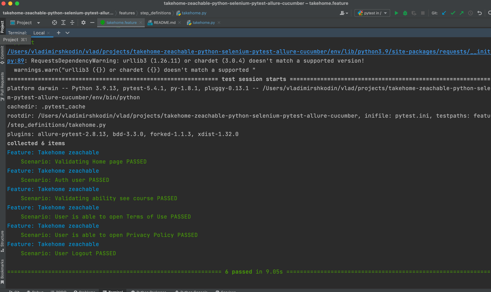
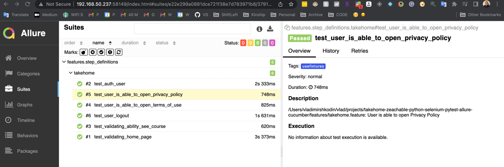
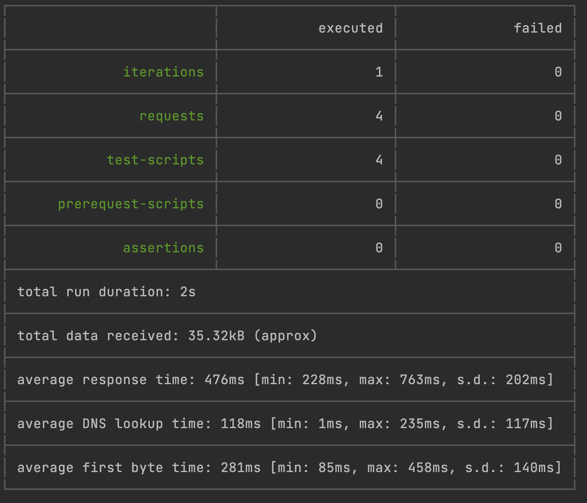
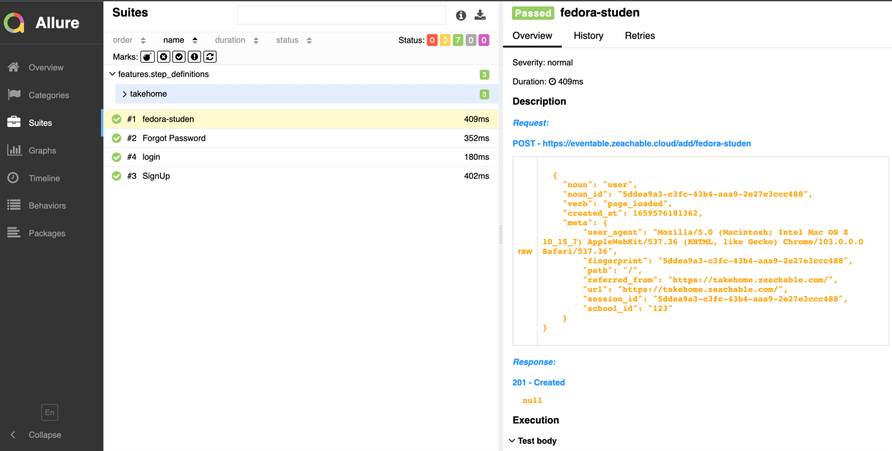
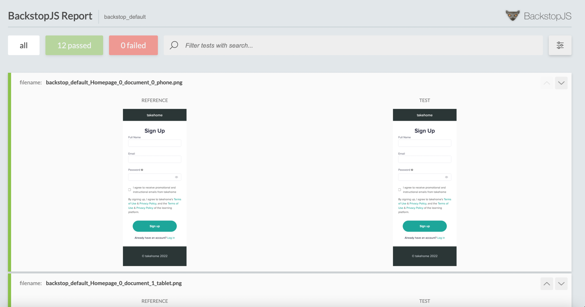

### Example of UI Testing Framework using Python, Pytest, Pytest-BDD, and Selenium.

[Test plan](https://docs.google.com/document/d/1yU7LNGNEMCRSPuB21Mb32SgAE_WPklTZ4qouoAUmvd8/edit?usp=sharing)

[Load/Performance test results](https://docs.google.com/document/d/1queAzmeWT_8DiEDIP_3EF5jcR_qgWpUf_8R7DeOV1JI/edit?usp=sharing)


https://takehome.zeachable.com/

### How to Build/Run locally:
#### Clone repo:
```
git clone https://github.com/vshkodin/takehome-zeachable-python-selenium-pytest-allure-cucumber.git
cd takehome-zeachable-python-selenium-pytest-allure-cucumber
```
#### Dependencies 
1. In order to run you have to install Python3.6+
2. You need to have pip installed
3. You need to have homebrew installed
4. install python3 - pip  https://www.python.org/downloads/
5. Getting dependencies:
```
$ pip3 install virtualenv
$ python3 virtualenv env
$ env/Scripss/activate (for win)
$ source env/bin/activate (for mac-linux)
$ pip install -r requirements.txt
$ brew install allure
$ brew install node
```

#### Running  tests






* Headful is default run
```
make ui-test 
```

* in order to run Headless

```
make ui-test-headless
```

* See report 

```commandline
make ui-report
```

* HOW to build/run with docker

```commandline
make ui-docker-build
make ui-docker-test
```

## API tests Using Postman Newman
* CLI report for API



* Allure report for API



* HOW to build

```
make api-build-local
```

* HOW to run

```
make api-test
```

* HOW to build/run with docker

```commandline
api-docker-build
api-docker-run
```

* See report 

```commandline
make api-report
```


## VRT tests using BackstopJS

* BackstopJS report



* HOW to run

```commandline
make vrt-test
```

* HOW to build/run/approve with docker

```commandline
vrt-docker-build
vrt-docker-run
vrt-docker-approve
```

* HOW to approve bitmaps

```commandline
make vrt-approve
```

* See report 

```commandline
make vrt-report
```